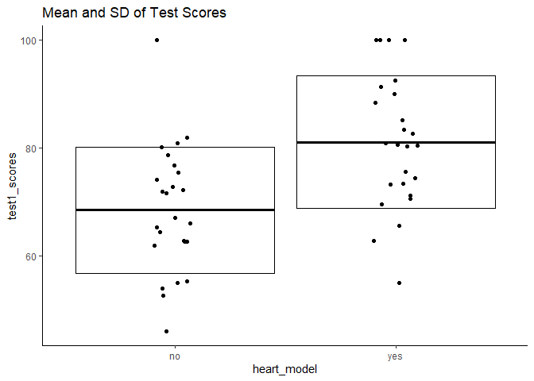

3D Printed Heart Model Simulated Data and Analysis
================

# About this Document

This is a short example I made for a reddit user who was asking about
the appropriate statistical method to use for an experiment the user was
planning.

Link:
<https://www.reddit.com/r/statistics/comments/hfzqh3/question_which_data_representation_is_most/>

Original post:

"Hi I’m trying to do a research on whether a 3D printed heart model will
improve my students’ learning in the medical field.

My plan is to have two groups of students to study for a test with and
without the aid of the 3D printed heart model respectively. Their test
score will be recorded and processed into a graph to be compared.

Another test will be held in six weeks on the same batch of students and
scores will be recorded, processed and compared to their previous test
scores. The goal is to check whether the 3d heart model will help
students to remember what they have learnt.

My question is what type of graphs would be most suitable to analyse
these results?"

# Consider the problem

## Assumptions

I’ll assume that we’re comparing 2 different classes of equal size for
this problem. I’ll also assume that any other potentially impactful
variables of each student (e.g. sex, aptitude, temperament, etc.) are
equally distributed between each class. I’ll say that you’ve got 25
students per class.

To note, the suggestion by user standard\_error to use block
randomization is a very good suggestion. I.e., this prevents all
students in class A having the model while all students in class B lack
the model. This entire class separation introduces method bias into your
set-up that could only be alleviated by repeating this experiment over
multiple semesters/years and randomizing which class is A or B. For the
purposes of this demonstration, I’m going to assume that block
randomization is not feasible (i.e. students would notice if half of
their classmates have a model that they don’t get to use). If this is
feasible, feel free to reach back out to me, and I can rewrite this
script to account for that

``` r
library(dplyr)
library(tidyr)
library(ggplot2)
library(ez)
```

# Simulating the data

``` r
set.seed(12)

df <- data.frame(student_id = c(1:50), #An arbitrary id variable that uniquely identifies each student
                 
           heart_model = c(rep("yes", 25), rep("no", 25)), #This variable designates the heart model and essentially designates class A vs. class B
           
           test1_scores = c(rnorm(25, 85, 15), #I'm assuming that heart+ students will have a mean test score of 85 with standard deviation (sd) of 15
                            rnorm(25, 70, 15)) #I'm assuming that hear- students will have a mean test score of 70 with the same sd
           )

df_cor <- df %>% 
  
  mutate(test1_scores = sapply(df$test1_scores, function(x) 
    ifelse(x > 100, 100, x))) %>% #this will cap scores at 100 if the rnorm function pushes them above 100
  
  mutate(test2_scores = ifelse(heart_model == "yes", 
                               yes = test1_scores + rnorm(1, -10, 5), #Test scores will only drop by 10 points with the heart model
                               no = test1_scores + rnorm(1, -20, 5))) #Test scores will drop by 15 points for no heart model

head(df_cor)
```

    ##   student_id heart_model test1_scores test2_scores
    ## 1          1         yes     62.79149     52.57806
    ## 2          2         yes    100.00000     89.78658
    ## 3          3         yes     70.64883     60.43541
    ## 4          4         yes     71.19992     60.98650
    ## 5          5         yes     55.03537     44.82194
    ## 6          6         yes     80.91556     70.70213

# Plotting the data

Let’s plot the test 1 scores as a function of the heart model variable

``` r
ggplot(df_cor, aes(heart_model, test1_scores))+
  geom_boxplot()+
  geom_jitter(height = 0,
              width = 0.1)+
  ggtitle("Boxplot (Median and IQRs) of Test Scores")+
  theme_classic()
```

<!-- -->

Alternatively, we could look at the mean and standard deviation

``` r
ggplot(df_cor, aes(heart_model, test1_scores))+
  stat_summary(geom = "crossbar", fun.data = "mean_sdl",
               fun.args = list(mult = 1))+
  geom_jitter(height = 0,
              width = 0.1)+
  ggtitle("Mean and SD of Test Scores")+
  theme_classic()
```

<!-- -->

Now let’s plot the change in scores over time

``` r
df_cor %>% 
  pivot_longer(cols = c(test1_scores, test2_scores),
               names_to = "test",
               values_to = "scores") %>% 
  ggplot(.)+
  aes(test, 
      scores, 
      color = heart_model
      )+
  stat_summary(geom = "crossbar", fun.data = "mean_sdl",
               fun.args = list(mult = 0),
               width = 0.5)+
  geom_line(aes(group = student_id), alpha = 0.2)+
  geom_point(aes(group = student_id), size = 3, alpha = 0.5)+
  ggtitle("Difference in Test Scores between Heart Model Groups")+
  theme_classic()+
  labs(caption = "Horizontal bars represent the group means")
```

<!-- -->

# Analyze the Data

## Consider your question

Now, your question is: “Does the heart model improve student’s retention
of the material?” You’re assessing whether there is an interaction
between the use of the heart model and students’ abilities to perform on
tests reviewing material they learned previously. We can test this using
a two-way ANOVA mixed model (completely random on variable heart\_model
and repeated measures on variable test)

## ANOVA

``` r
df_cor %>% 
  pivot_longer(cols = c(test1_scores, test2_scores),
               names_to = "test",
               values_to = "scores") %>% 
  mutate(student_id = as.factor(student_id),
         test = as.factor(test)) %>% 
  ezANOVA(dv = scores, 
          wid = student_id,
          between = heart_model,
          within = test)
```

    ## Warning: Converting "heart_model" to factor for ANOVA.

    ## $ANOVA
    ##             Effect DFn DFd            F            p p<.05       ges
    ## 2      heart_model   1  48 2.754651e+01 3.441394e-06     * 0.3646298
    ## 3             test   1  48 3.124405e+17 0.000000e+00     * 0.3005450
    ## 4 heart_model:test   1  48 3.533424e+16 0.000000e+00     * 0.0463416

## Consider the Results

Here, from this ANOVA test, we see that there is a significant
interaction between the use of the heart model and students’
performances on the two tests. The hypothesis test portion of this is
done. It is not appropriate to test the main effects of each variable
given that there is a significant interaction at play. Instead, we can
just collect the descriptive summary statistics (ie the difference in
means, sd, etc.) in a summary table.

## Summary Table

``` r
df_cor %>% 
  pivot_longer(cols = c(test1_scores, test2_scores),
               names_to = "test",
               values_to = "scores") %>% 
  group_by(heart_model, test) %>% 
  summarise(mean = mean(scores), sd = sd(scores), range = max(scores) - min(scores),
            best = max(scores)) %>% 
  kableExtra::kable()
```

    ## `summarise()` has grouped output by 'heart_model'. You can override using the `.groups` argument.

<table>
<thead>
<tr>
<th style="text-align:left;">
heart\_model
</th>
<th style="text-align:left;">
test
</th>
<th style="text-align:right;">
mean
</th>
<th style="text-align:right;">
sd
</th>
<th style="text-align:right;">
range
</th>
<th style="text-align:right;">
best
</th>
</tr>
</thead>
<tbody>
<tr>
<td style="text-align:left;">
no
</td>
<td style="text-align:left;">
test1\_scores
</td>
<td style="text-align:right;">
68.49433
</td>
<td style="text-align:right;">
11.67543
</td>
<td style="text-align:right;">
53.93438
</td>
<td style="text-align:right;">
100.00000
</td>
</tr>
<tr>
<td style="text-align:left;">
no
</td>
<td style="text-align:left;">
test2\_scores
</td>
<td style="text-align:right;">
47.93097
</td>
<td style="text-align:right;">
11.67543
</td>
<td style="text-align:right;">
53.93438
</td>
<td style="text-align:right;">
79.43665
</td>
</tr>
<tr>
<td style="text-align:left;">
yes
</td>
<td style="text-align:left;">
test1\_scores
</td>
<td style="text-align:right;">
81.10342
</td>
<td style="text-align:right;">
12.27680
</td>
<td style="text-align:right;">
44.96463
</td>
<td style="text-align:right;">
100.00000
</td>
</tr>
<tr>
<td style="text-align:left;">
yes
</td>
<td style="text-align:left;">
test2\_scores
</td>
<td style="text-align:right;">
70.89000
</td>
<td style="text-align:right;">
12.27680
</td>
<td style="text-align:right;">
44.96463
</td>
<td style="text-align:right;">
89.78658
</td>
</tr>
</tbody>
</table>
